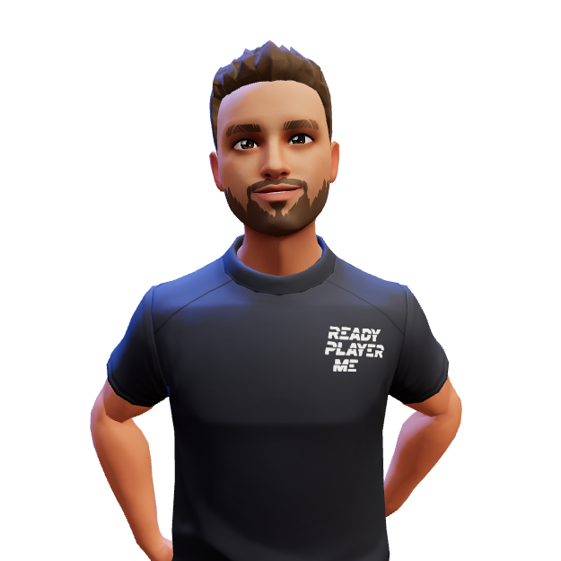

<h1>Hi , I'm Uzair </h1>

<h1>About me</h1>

I'm quietly confident, self-motivated and hardworking seeking for an opportunity to work in a challenging environment to prove my skills and utilize my knowledge. And most important I love to create new things.

  

<h1>My Portfilio</h1>
<a href="https://uxairishere.github.io/profile">Visit my portfolio by clicking here</a>

or scan the QR code to navigate

